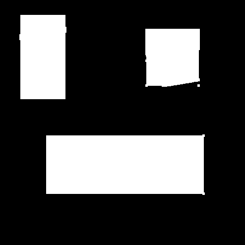

### Find Image Gradient
Программа позволяет находить на изображении участки с градиентной заливкой (прямоугольной формы, стороны параллельны границам изображения).
Она строит маску (есть ли на исходном изображении в этом месте градиентная заливка), а так же при необходимости выделяет искомые прямоугольники и получает координаты их вершин.
Ниже есть примеры обоих сценариев использования

### Установка
Для запуска необходим python3 (протестировано на 3.7)

Установка зависимостей, рекомендуется выполнять в virtualenv:
```
pip install -r requirements.txt
```

### Запуск
- С поиском координат прямоугольников: ```python main.py -f images/many_gradients.png --coordinates --plot```

- Только вывод маски: `python main.py -f images/small_gradients.png --plot`

- Не отображать результат через matplotlib, только запись в файл: `python main.py -f images/small_gradients.png`

Маска сохраняется в `<filename>_mask.png`, например `images/small_gradients.png_mask.png`


### Описание алгоритма
- Сначала изображение разбивается на 3 канала: красный, зелёный, синий
- Затем применяется свертка [опреатором Щарра](https://ru.m.wikipedia.org/wiki/%D0%9E%D0%BF%D0%B5%D1%80%D0%B0%D1%82%D0%BE%D1%80_%D0%A1%D0%BE%D0%B1%D0%B5%D0%BB%D1%8F#%D0%9E%D0%BF%D0%B5%D1%80%D0%B0%D1%82%D0%BE%D1%80_%D0%A9%D0%B0%D1%80%D1%80%D0%B0), что даёт градиент исходного изображения
- После этого полученный градиент бинаризируется для выделения областей, в которых на исходном изображении находятся градиентные заливки
- Применяется размытие для удаления выбросов и еще одна бинаризация
- Полученное изображение - готовая маска
- При необходимости (задается параметром запуска программы) можно получить координаты прямоугольников на исходном изображении, для этого производится поиск белых прямоугольников по маске


### Примеры
#### Координаты


#### Маска


